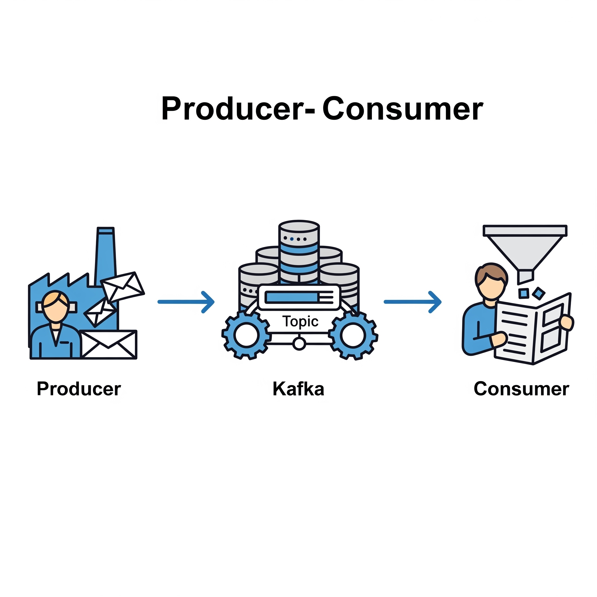

# Introduction

아파치 카프카는 '분산 커밋 로그' 혹은 '분산 스트리밍 플랫폼' 이라고 불리기도 한다.&#x20;

* 카프카는 메시지를 배치(batch) 단위로 저장한다.

메시지를 쓸 때마다 네트워크 신호가 오간다면 막대한 오버헤드가 발생하는데, 메시지를 배치 단위로 모아서 쓰면 이것을 줄일 수 있다. 예를들어, 메시지 100개는 네트워크 요청이 100번 이루어지지만 배치 전송은 1번의 요청으로 처리된다.

&#x20;하지만, 배치 크기가 커질 수록 시간당 처리량은 늘어나지만, 지연시간은 늘어나는 트레이드오프를 발생시킨다.

### 카프카의 프로듀서와 컨슈머는 데이터를 생산하고 소비하는 핵심 주체이다.

.

* 프로듀서 (Producer) 🧑‍💻➡️: 메시지(데이터)를 생성하여 카프카의 특정 주제(Topic)로 보내는 역할을 한다. 데이터를 만드는 생산자이다.
* 컨슈머 (Consumer) ⬅️🧑‍🔧: 토픽을 구독(subscribe)하고, 저장된 메시지를 가져와서 원하는 작업을 처리한다. 데이터를 사용하는 소비자이다.

이 구조 덕분에 프로듀서와 컨슈머는 서로를 직접 알 필요 없이, 카프카를 통해 데이터를 안정적으로 주고받을 수 있다.

## 토픽과 파티션

카프카에서 토픽(Topic)은 카프카가 메시지를 카테고리화하여 저장하는 방식입니다. 각 토픽은 논리적인 스트림의 단위를 제공하며, 프로듀서가 메시지를 한 토픽에 쓰고, 컨슈머가 메시지를 그 토픽에서 읽습니다.

파티션(Partition)은 토픽을 물리적으로 나누어 분산 저장하는 단위입니다. 각 토픽은 하나 이상의 파티션으로 구성되며, 파티션은 메시지를 저장하는 실질적인 단위가 됩니다. 파티션은 특정 순서에 따라 메시지를 저장하며, 각각의 파티션은 독립적인 로그(log)로 간주됩니다. 이를 통해 카프카는 수평 스케일링(horizontal scaling)을 지원하고 더 높은 병렬 처리 성능을 제공합니다.

파티션 덕분에 카프카는 높은 확장성, 가용성, 성능을 유지하며 데이터의 순서를 보장할 수 있습니다. 각 파티션이 독립적으로 컨슈머에게 할당될 수 있기 때문에 읽기 작업을 병렬로 수행할 수 있으며, 이는 처리를 더욱 효율적으로 만들어줍니다.

## 파티션의 존재 이유

* 하나의 토픽으로도 메시지 처리가 가능하지만, 왜 토픽 내부에는 여러 파티션으로 나뉘어져 있을까?&#x20;

* 왜 파티션 하나에 하나의 컨슈머만 접근이 가능한가?

## 파티션 리더

&#x20;파티션은 클러스터 안의 브로커 중 하나가 담당하며, 그 브로커를 파티션 리더 라고 부른다. 복제된 파티션이 여러 브로커에 할당될 수도 있는데 이것들을 파티션의 팔로워 라고 부른다.

&#x20;햇갈렸던 것은 '파티션 리더'인 브로커의 모든 파티션들을 팔로워들이 복제하여 부하를 분산하는 개념이라고 이해하였다.

&#x20;파티션 리더는 여러 브로커에 할당할 수 있으며, 리더와 팔로워가 할당되는 기준은 '브로커'가 아닌 '파티션' 단위로 이해하면 될 것 같다. (ElasticSearch도 동일한 아키택처를 가지고있다고 한다.)

### 브로커와 클러스터

하나의 카프카 서버를 브로커라고 부른다. 이는 메시지를 수신하여 디스크에 안전하게 저장하는 핵심적인 역할을 담당한다. 프로듀서가 전송한 데이터를 토픽 단위로 관리하며, 컨슈머의 요청이 있을 때 해당 데이터를 전달하는 책임을 진다.

* 클러스터

클러스터는 여러 대의 브로커를 하나로 묶어 구성한 단일 시스템을 말한다. 이중 하나의 브로커가 컨트롤러의 역할을 하게 된다. (작동중인 브로커 중 하나가 자동으로 선정된다)  컨트롤러는 파티션을 브로커에 할당하거나 브로커를 모니터링 하는 등의 관리 기능을 담당한다.

하나의 브로커에 장애가 발생하더라도, 클러스터 내의 다른 브로커가 작업을 이어받는다. 이를 통해 데이터의 유실 없이 안정적인 서비스 운영을 보장한다.

* 클러스터 내 브로커의 갯수는 홀수단위로 (3, 5)

쿼럼 방식을 사용, 과반수 이상의 투표자로 파티션 리더를 선정하기 때문에 홀수단위로 저장을 해야한다.

(ElasticSearch 도 같은 클러스터 개념을 가지고 있다.)

## 느슨한 결합 (Loose Coupling)

ㄱ

## 디스크 기반 보존

레빗엠큐 ( 메모리 큐, 디스크 기반으로도 가능 )

레디스 ( 메모리 큐 )

카프카 (디스크 보존 )

